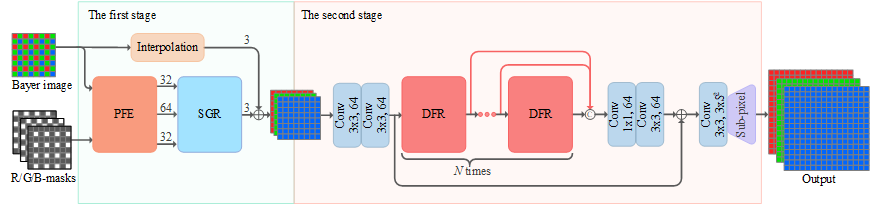
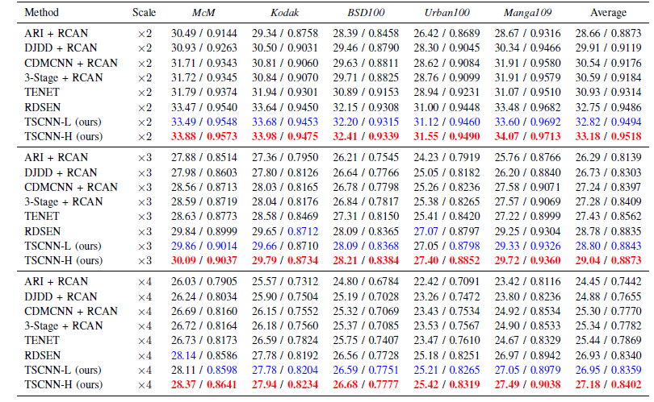

# TSCNN

## [Paper](https://ieeexplore.ieee.org/document/9620041)
Kan Chang, Hengxin Li, Yufei Tan, Pak Lun Kevin Ding, Baoxin Li, " A Two-Stage Convolutional Neural Network for Joint Demosaicking and Super-Resolution", IEEE Trans. Circuits Syst. Video Technol. 2021.


## Dependencies
* Python == 3.6
* Pytorch == 1.6.0
* torchvision == 0.7.0
* numpy == 1.18.5
* skimage == 0.16.2

## Contents
1. [Abstract](#abstract)
2. [Architecture](#architecture)
2. [Folder structure](#folder-structure)
3. [Prepare beachmark data](#prepare-beachmark-data)
4. [Train](#train)
5. [Test](#test)
6. [Results](#results)
7. [Citation](#citation)
8. [Acknowledgement](#acknowledgement)

## Abstract
As two practical and important image processing tasks, color demosaicking (CDM) and super-resolution (SR) have been 
studied for decades. However, most literature studies these two tasks independently, ignoring the potential benefits of 
a joint solution. In this paper, aiming at efficient and effective joint demosaicking and super-resolution (JDSR), a 
well-designed two-stage convolutional neural network (CNN) architecture is proposed. For the first stage, by making use 
of the sampling-pattern information, a pattern-aware feature extraction (PFE) module extracts features directly from the
Bayer-sampled low-resolution (LR) image, while keeping the resolution of the extracted features the same as the input. 
For the second stage, a dual-branch feature refinement (DFR) module effectively decomposes the features into two 
components with different spatial frequencies, on which different learning strategies are applied. On each branch of the 
DFR module, the feature refinement unit, namely, densely-connected dual-path enhancement blocks (DDEB), establishes a 
sophisticated nonlinear mapping from the LR space to the high-resolution (HR) space. To achieve strong representational 
power, two paths of transformations and the channel attention mechanism are adopted in DDEB. Extensive experiments 
demonstrate that the proposed method is superior to the sequential combination of state-of-the-art (SOTA) CDM and 
SR methods. Moreover, with much smaller model size, our approach also surpasses other SOTA JDSR methods.

## Architecture

The overall structure of the proposed TSCNN.



For more details, please refer to our paper.

## Folder structure
Download the TSCNN first. The following shows the basic folder structure.
```

├── DATA # Please make a new folder for training and testing dataset.
│   ├── div2k
│   │   ├── ori 
│   │   │   ├── train 
│   │   │   │   ├── data
│   │   │   │   ├── dem
│   │   │   │   └── label
│   │   └── bin
│   │   │   └── train 
│   │   │   │   └──div2k_train.npz 
│   ├── kodak 
│   │   └── bin
│   │   │   └── test 
│   │   │   │   └──kodak_test.bin 
│   └── mcm 
│   │   └── bin
│   │   │   └── test 
│   │   │   │   └──mcm_test.bin 
├── code # train and testing code
├── create_bin.py # Save div2k dataset into a uncompressed .npz archive 

```

## Prepare beachmark data

1. [DIV2K](https://data.vision.ee.ethz.ch/cvl/DIV2K/) is used as training dataset. Download pre-processed dataset (DIV2K including data, dem, label)[Google Drive](https://drive.google.com/drive/folders/1yUgxtUwgTslicWS5Uuv1nWhUYlZw0GB0?usp=sharing).
   Unzip and place them in ```./DATA/div2k/ori```. To improve the speed of reading pictures, the dataset will be saved to a binary file(.npz).
    
    ```bash
    python create_bin.py
    ```

   We pre-processed this dataset by the following three steps:
   1. The original images of DIV2K is used for label.
   2. To generate data, we first downsample the original images to obtain the LR images and then apply Bayer sampling on the LR images. 
   3. To generate dem, the mosaicked LR image is also demosaicked in parallel by MLRI.

2. The testing datasets McM and Kodak are also provided here [Google Drive](https://drive.google.com/file/d/1ngs72pZXipYCMWOlxV4hSwTz4oDOBlEj/view?usp=sharing).
   The same as DIV2K, the testing datasets McM and Kodak have also been pre-processed and pickled into a binary file(.bin). Place them in ```./DATA```, therefore you can evaluate the model on these datasets.


## Train

1. Follow the scripts to train.

    1. Cd to './code'
    ```bash
    # Scale 2,3,4
    #-------------TSCNN_L_x2 
    --s_model TSCNN.RDSRN  --RDNconfig A --n_patch_size 96  --s_train_dataset div2k.DIV2K --s_eval_dataset mcm.Mcm+kodak.Kodak
    #-------------TSCNN_L_x3 
    --s_model TSCNN.RDSRN  --RDNconfig A --n_patch_size 144 --s_train_dataset div2k.DIV2K --s_eval_dataset mcm.Mcm+kodak.Kodak
    #-------------TSCNN_L_x4 
    --s_model TSCNN.RDSRN  --RDNconfig A --n_patch_size 192 --s_train_dataset div2k.DIV2K --s_eval_dataset mcm.Mcm+kodak.Kodak
    #-------------TSCNN_H_x2 
    --s_model TSCNN.RDSRN  --RDNconfig B --n_patch_size 96  --s_train_dataset div2k.DIV2K --s_eval_dataset mcm.Mcm+kodak.Kodak
    #-------------TSCNN_H_x3
    --s_model TSCNN.RDSRN  --RDNconfig B --n_patch_size 144 --s_train_dataset div2k.DIV2K --s_eval_dataset mcm.Mcm+kodak.Kodak
    #-------------TSCNN_H_x4
    --s_model TSCNN.RDSRN  --RDNconfig B --n_patch_size 192 --s_train_dataset div2k.DIV2K --s_eval_dataset mcm.Mcm+kodak.Kodak

    ```
     
    Training files (logs, models, config and visualizations) will be saved in the directory ```./experiments/{name}```

## Test

1. We provide six pre-trained models in the `./code/pretrained_models`.

2. Cd to './code', run the following scripts to test models.

    ```bash
    # Scale 2,3,4
    #-------------TSCNN_L_x2 
    --s_model TSCNN.RDSRN  --RDNconfig A --n_patch_size 96   --pre_train TSCNN_Lx2.pth --b_test_only True --s_train_dataset div2k.DIV2K --s_eval_dataset mcm.Mcm+kodak.Kodak
    #-------------TSCNN_L_x3 
    --s_model TSCNN.RDSRN  --RDNconfig A --n_patch_size 144  --pre_train TSCNN_Lx3.pth --b_test_only True --s_train_dataset div2k.DIV2K --s_eval_dataset mcm.Mcm+kodak.Kodak
    #-------------TSCNN_L_x4 
    --s_model TSCNN.RDSRN  --RDNconfig A --n_patch_size 192  --pre_train TSCNN_Lx4.pth --b_test_only True --s_train_dataset div2k.DIV2K --s_eval_dataset mcm.Mcm+kodak.Kodak
    #-------------TSCNN_H_x2 
    --s_model TSCNN.RDSRN  --RDNconfig B --n_patch_size 96   --pre_train TSCNN_Hx2.pth --b_test_only True --s_train_dataset div2k.DIV2K --s_eval_dataset mcm.Mcm+kodak.Kodak
    #-------------TSCNN_H_x3
    --s_model TSCNN.RDSRN  --RDNconfig B --n_patch_size 144  --pre_train TSCNN_Hx3.pth --b_test_only True --s_train_dataset div2k.DIV2K --s_eval_dataset mcm.Mcm+kodak.Kodak
    #-------------TSCNN_H_x4
    --s_model TSCNN.RDSRN  --RDNconfig B --n_patch_size 192  --pre_train TSCNN_Hx4.pth --b_test_only True --s_train_dataset div2k.DIV2K --s_eval_dataset mcm.Mcm+kodak.Kodak

    ```

    If you want to save the output images for each dataset, you need to add `--b_save_results True` to test commands.


## Results
### Quantitative Results


Quantitative comparison among different models on five datasets (Average CPSNR (dB) /SSIM). The numbers in red and blue indicate the best and the second-best methods, respectively.

### Visual Results


Results of img92 from Urban100 (×2). From left to right and top to bottom: DJDD + RCAN, CDMCNN + RCAN, 3-Stage + RCAN, TENet, RDSEN, TSCNN-L, TSCNN-H, Original image.


Results of img60 from Urban100 (×3). From left to right and top to bottom: DJDD + RCAN, CDMCNN + RCAN, 3-Stage + RCAN, TENet, RDSEN, TSCNN-L, TSCNN-H, Original image.

## Citation
If you use this dataset or code for your research, please cite our paper.
```
@ARTICLE{9620041,
  author={Chang, Kan and Li, Hengxin and Tan, Yufei and Ding, Pak Lun Kevin and Li, Baoxin},
  journal={IEEE Transactions on Circuits and Systems for Video Technology}, 
  title={A Two-Stage Convolutional Neural Network for Joint Demosaicking and Super-Resolution}, 
  year={2021},
  volume={},
  number={},
  pages={1-1},
  doi={10.1109/TCSVT.2021.3129201}}
```

## Acknowledgement
This code is built on [EDSR (PyTorch)](https://github.com/thstkdgus35/EDSR-PyTorch). 
We also refer to some other work such as [RCAN](https://github.com/yulunzhang/RCAN), 
[pytorch-OpCounter](https://github.com/Lyken17/pytorch-OpCounter), [partial conv](https://github.com/NVIDIA/partialconv),
[MLRI](http://www.ok.sc.e.titech.ac.jp/res/DM/MLRI.zip). We thank these authors for sharing their codes.


